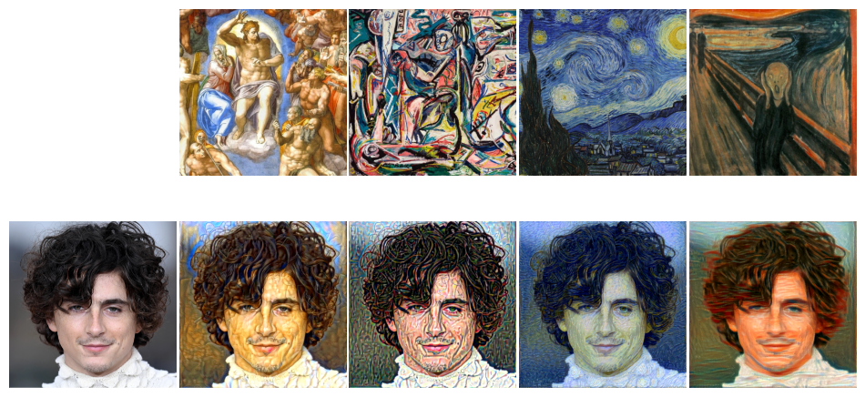
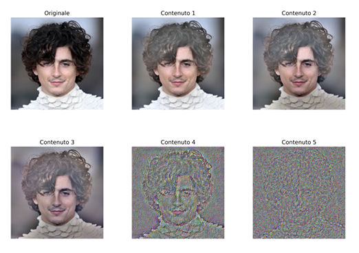
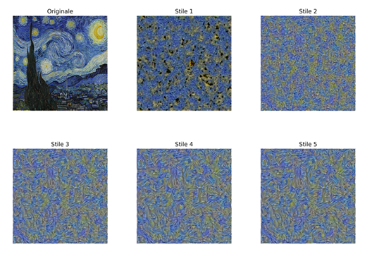

# Neural transfer project

<!-- FIGURA 1: Contenuto vs layer -->
<p align="center">
  
</p>

## Setup

Il Trasferimento di Stile Neurale (NTS) è una tecnica che genera un’immagine “ibrida” combinando il contenuto di un'immagine (es. foto) con lo stile di un'altra (es. dipinto). Si usa una CNN pre-addestrata (VGG19): il contenuto è rappresentato dalle attivazioni dei layer profondi (catturano struttura/oggetti), mentre lo stile è modellato con le matrici di Gram delle feature su più layer (catturano texture e correlazioni tra filtri). L’immagine generata viene ottimizzata per minimizzare la loss totale **$L= \alpha L_{\text{content}} + \beta L_{\text{style}}$**
così da bilanciare fedeltà al contenuto e coerenza stilistica. Si è usato VGG19 considerando solo i layer convoluzionali. Per studiare la fusione stile–contenuto:

contenuto = foto di Timothée Chalamet;  
stile = “Notte stellata” (Van Gogh), “L’Urlo” (Munch), “Convergence” (Pollock), “Giudizio universale” (Michelangelo).


## Risultati

Ispirandoci a Gatys et al. (2015), i nostri esperimenti mostrano che la scala delle rappresentazioni nei diversi layer di VGG19 controlla direttamente l’aspetto delle ricostruzioni: quando il **contenuto** è imposto su layer bassi emergono bordi e micro-dettagli ma la struttura globale resta instabile; su layer intermedi/alti (es. conv4_2) si preserva meglio la **semantica complessiva** a scapito di qualche finezza locale. 

<!-- FIGURA 1: Contenuto vs layer -->
<p align="center">
  
</p>
<p align="center"><em>Figura 1 — Ricostruzione del contenuto su conv1_2, conv2_2, conv3_2, conv4_2, conv5_2.</em></p>

Per lo **stile**, usare le Gram dei soli primi layer produce **trame fini** e grana minuta, mentre includere progressivamente layer più profondi consolida **palette** e **pattern su larga scala**. Nella **fusione stile+contenuto** il rapporto $\( \alpha/\beta \)$ governa l’“invasività” dello stile: $\( \alpha \)$ alto mantiene la forma del soggetto, $\( \beta \)$ alto fa entrare più texture e cromie; oltre al rapporto globale, i pesi per layer di stile permettono di modulare la **scala** della texture (enfatizzare conv1 → trame fini; conv5 → campiture e tratti ampi). Dinamicamente, partendo dall’immagine di contenuto $\( L_{\text{content}} \)$ è inizialmente piccola e $\( L_{\text{style}} \)$ tende a dominare i primi passi anche con $\( \beta \ll \alpha \)$, spiegando perché le caratteristiche stilistiche compaiono presto.


<!-- FIGURA 2: Stile vs layer -->
<p align="center">
  
</p>
<p align="center"><em>Figura 2 — Ricostruzione dello stile usando matrici di Gram su insiemi crescenti di layer (solo conv1 → conv1–2 → … → conv1–5).</em></p>

---

# Prerequisiti:

- Python 3.9+

- pip aggiornato

- (Opzionale) GPU NVIDIA con driver aggiornati

  ---

# Guida d'utilizzo

> Esegui i comandi dalla cartella del progetto (es. `C:\NTS`).  
> Le immagini di input vanno in `data/`, l’output viene salvato in `results/`.

## 1) Preparazione ambiente

### Windows (PowerShell)
```powershell
D:
cd NTS
python -m venv .venv
.\.venv\Scripts\Activate
python -m pip install --upgrade pip
pip install -r requirements.txt
```

### macOS/Linux (Bash)
```
cd ~/NTS
python -m venv .venv
source .venv/bin/activate
python -m pip install --upgrade pip
pip install -r requirements.txt
```
# 2) Inserisci i dati

Metti le immagini in data/, ad esempio:

```
data/Themothee.png
data/Notte stellata.jpg
```

>Nomi con spazi sono ok se usi le virgolette nei comandi.
>Le immagini RGBA vengono convertite in RGB dal loader.

#3) Esecuzione
Avvio con i default

Se i file sopra esistono:
```
python .\src\core.py
```
Avvio con parametri personalizzati
### Windows (PowerShell) 
```
python .\src\core.py --content_path "data\YourContent.jpg" --style_path "data\Notte stellata.jpg" --output_path "results\out.png" --imsize 384 --steps 400 --lr 0.02 --alpha 1.0 --beta 80000 --init content
```

### macOS / Linux (bash)
```
python ./src/core.py --content_path "data/YourContent.jpg" --style_path "data/Notte stellata.jpg" --output_path "results/out.png" --imsize 384 --steps 400 --lr 0.02 --alpha 1.0 --beta 80000 --init content
```

Parametri principali

-content_path / --style_path / --output_path

-imsize → 256 / 384 / 512 (più grande = più lento, più dettagli)

-steps → iterazioni di ottimizzazione (200–1000 per test rapidi)

-lr → learning rate (0.01–0.05 tipico)

-alpha → peso contenuto

-beta → peso stile (di solito alto: 50_000–100_000)

-init → content (stabile) o noise (più creativo)

Durante il run vedrai log della loss; l’immagine viene salvata in --output_path.
